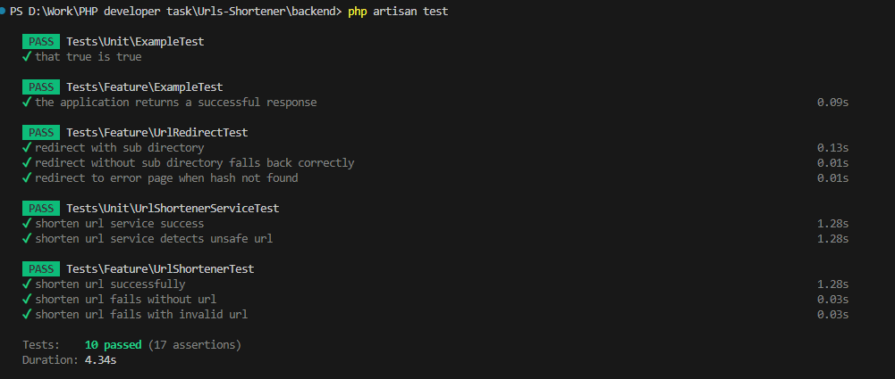

# URLs Shortener (Task for PHP developer)

### Technologies Used

* Laravel 10
* Vue3
* MySQL
* GuzzleHTTP for API requests

### Setup

1. Clone the repository

   `git clone https://github.com/Eagle9461/URLs-Shortener.git`
2. Input API key, DB, Backend Info.

* .env.local in frontend folder (Note Backend server url)
* .env file in backend folder (Note DB and GCP information)

3. Run (or Test) Backend.

   ```
   cd Backend
   php artisan migrate
   php artisan serve (php artisan test)
   ```
4. Run (or Test) Frontend

   ```
   cd frontend
   npm install
   npm run dev
   ```

### Test 


